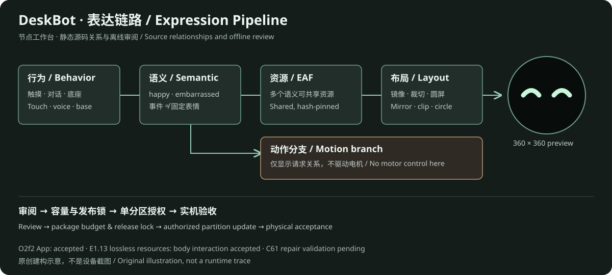
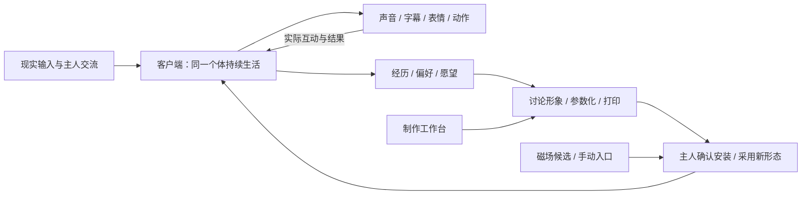

# DeskBot Hardware

[简体中文](README.md) · [English](README.en.md)

**同一个体持续成长，让共同经历成为可触摸的形态。**

基于 ESP-VoCat 的桌宠固件与制作工作台。客户端负责生活、记忆与成长，桌宠负责感知和表达；工作台制作、预览并安装角色资源。换壳保留身份、记忆和关系，磁场提供候选，主人确认实际安装。

## 当前进度 · 2026-11-27

**当前重点是完成素材替换到实机安装的闭环。** r8 分层表情与闹钟管理版已安装；真实素材工作台已完成电脑端验证。小智语音、共同记忆、联网摸头和主人确认换壳已有实机验收，客户端独立开发自主生活与成长。见[当前主线](docs/project-mainline.md)、[架构](docs/architecture.md)与[本轮发布](docs/publication-20261127.md)。

| 部分 | 已有成果 | 接下来 |
| --- | --- | --- |
| 桌宠本体 | E3f-9d.7 日常交互、冷启动和充电切换已验收；闹钟修复已安装核对 | 语音查询／取消闹钟验收，持续运行与电量反馈 |
| 高清表情 | r8：29 种语义、480→360、完整表演与独立眼时序；修正聆听条和底座插入入口 | r8 实屏表演、聆听条及底座重连观察 |
| 制作工作台 | GIF/EAF/PNG 上传、镜像、360 预览、生产格式编译、容量检查、成对安装与恢复 | 网页安装和恢复上一版实机验收 |
| 身体与客户端 | USB／Wi-Fi 表情、摸头入档、安装同步；联网凭据换新和恢复已实测 | 热点重连、实际登录自启和长期运行 |
| 语音与日常 | 小智近况、语音记事、共同记忆更正后引用已验收；统一后台已部署 | 真实生活愿望的联合体验 |
| 外壳与成长 | A/B 主人确认已验收，模拟磁场基线已保存；自主生活由客户端开发 | 真实外壳制作、试装和拆装校准 |

当前设备为 **E3f-9d.7 基线 + 分层 r8 + 闹钟管理修复**，32 MiB Flash / 16 MiB PSRAM。资源有效数据 3,993,973 B，8 MiB 分区余 4,394,635 B；当前 App 为 4,603,008 B。旧版每日 08:00 隐式提醒已关闭并在重启后核对。新闹钟语音操作、r8 实屏和网页安装／恢复待主人验收；此前已验收版本与现场恢复材料留本机。[表情接入](docs/layered-face-integration.md) · [闹钟管理](docs/alarm-management.md)

## 工作台与可视化



| 入口 | 用途 |
| --- | --- |
| [高清分层表情预览](artifacts/layered-face-20261124-r8/index.html) | 当前 29 种表情、左右眼节奏、途中切换与收尾 |
| [表情制作与替换](docs/expression-pipeline.md) | 上传素材、真实链路预览、编译、安装与恢复 |
| [当前工作台使用](docs/layered-face-integration.md) | 本机连接、资源预览、圆屏播放与验收 |
| [DeskBot Studio 历史预览](artifacts/deskbot-studio-e3d2-20261105/index.html) | 节点、素材、角色、发布、设备状态、快照与实时目录 |
| [节点预览](artifacts/expression-node-preview-e1-19-20261024/index.html) | 查看动画、替换前后效果及旧连接与新连接 |
| [角色表达编辑器](artifacts/role-expression-workbench-e1-31-20261029/index.html) | 为不同角色编辑语义与动画映射 |
| [资源目录与草稿对照](docs/deskbot-studio-e3d1-20261105.md) | 28 个表情语义、18 个 EAF、动作关联和逐项预览 |
| [设备实时目录](docs/deskbot-studio-e3d2-20261105.md) | 同一 USB 会话分页读取、完整摘要与连接状态 |
| [USB 使用说明](docs/deskbot-studio-e3c6-20261105.md) | 本机启动、状态查询与表情回执 |
| [完整可视化索引](docs/visualizations.md) | 各阶段的预览、审阅和机器报告 |

本机当前入口：[8782 工作台](http://127.0.0.1:8782/#connection) · [表情制作](http://127.0.0.1:8782/expressions/) · [高清表情](http://127.0.0.1:8782/layered-face/) · [4311 桌宠与共同记忆](http://127.0.0.1:4311/companion)。工作台使用唯一 USB 所有者；日常后台统一小智工具、正式存档、摸头和联网表情。客户端位于[独立仓库](https://github.com/404-NOT-FOUND-ERROR/DeskBot)。

仓库内公开 HTML 可直接查看。以下脚本启动早期 E3d2 公开预览，地址为 8772；当前接入流程见上方说明：

```powershell
python -m pip install -r tests/requirements-body-facts-validation.txt
& .\scripts\start-deskbot-studio-e3d2.ps1
```

启动脚本分别核对离线环境与串口环境。新电脑可使用 `serve-deskbot-studio-e3d2.py --public --serial-python <含 pyserial 的 Python 路径>` 启动公开版。页面保留官方资源预览、E1.18 历史快照与实时目录区域；素材来源与许可见 [THIRD_PARTY.md](THIRD_PARTY.md)。

## 完整产品链路


```mermaid
flowchart LR
    A[现实输入与主人交流] --> B[客户端：同一个体持续生活]
    B --> C[声音 / 字幕 / 表情 / 动作]
    C -->|实际互动与结果| B
    B --> D[经历 / 偏好 / 愿望]
    D --> E[讨论形象 / 参数化 / 打印]
    E --> F[主人确认安装 / 采用新形态]
    F --> B
    W[制作工作台] --> E
    M[磁场候选 / 手动入口] --> F
```

图中是完整产品目标。身体联网与小智生活接入已有验收，持续生活和真实制作按下方顺序联合交付。

## 后续开发顺序

1. **完成本轮验收**：r8 表演与聆听条、底座重连、闹钟语音查询／取消、网页安装与上一版恢复。
2. **完善日常运行**：实际登录自启、热点重连、持续运行，以及实板电量与充电状态反馈。
3. **完善自然交流**：沿用小智和同一个体存档，联合客户端验证真实生活与愿望。
4. **联合生活与愿望体验**：客户端独立完成生活成长验证，双方验收可感知的实际经历与愿望。
5. **完成真实制作与采用**：形象方案、参数 CAD、打印试装、配套角色包和安装接续。

每轮完成：明确范围 → 离线测试 → 独立构建与差异核对 → 备份与部署 → 实机验收。见[完整开发计划](docs/development-plan-20261104.md)、[架构](docs/architecture.md)与[行动指南](docs/development-pipeline-20261102.md)。

开发沿用唯一串口所有者。版本、资源和恢复入口见[当前基线](docs/baseline-status.md)。GitHub 在较大版本稳定后同步。

## 开发与验证

```powershell
python scripts/check-publication.py
python scripts/run-offline-checks.py
```

离线检查使用 Python 3.11+；原生 C/C++ 测试需要编译器。固件使用 ESP-IDF 5.5.5，见 [firmware/body](firmware/body/README.md)。Windows 本机先运行 `scripts/preflight-deskbot-toolchain.ps1` 核对环境。测试、构建、安装记录和人工验收分别保存。

| 目录 | 内容 |
| --- | --- |
| `firmware/body` / `firmware/releases` | S3 固件、锁定依赖与 N32R16 目标配置 |
| `firmware/base` | C61 历史增量与上游说明 |
| `protocol` | 身体事实、外壳、角色、表达和 USB 契约 |
| `scripts` / `tools` / `tests` | 构建、工作台、诊断与回归测试 |
| `artifacts` / `docs` | 公开预览、结果、架构与路线 |
| `gateway` | 早期客户端连接原型 |

O2f2 与 E1.13 保留为历史验收锚点。现场备份、NVS、原始串口日志、凭据与构建缓存保存在本机。见[本次发布说明](docs/publication-20261127.md)。

## 许可与来源

本项目新增文档、协议与工具使用 [MIT](LICENSE)。ESP-VoCat、小智、ESP-IDF 组件、字体和第三方动画沿用各自许可证，见 [THIRD_PARTY.md](THIRD_PARTY.md)。
